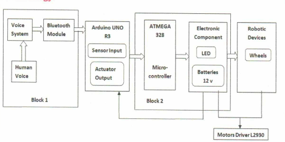

# Voice-Controlled Automatic Vacuum Cleaner Firmware (ATmega328)
Embedded Systems Project | ATmega328 | UART | Bluetooth | Real-Time Control
## Overview
Designed an embedded system for a voice-controlled automatic vacuum cleaner using the ATmega328 microcontroller. The system integrates Bluetooth communication, motor control, and sensor feedback to enable real-time operation.

---

## System Workflow
1. Voice command issued via Android application  
2. Command transmitted through Bluetooth (UART protocol)  
3. ATmega328 processes incoming data  
4. Motor driver executes movement instructions  
5. Sensors provide real-time feedback for control  

---

## Key Features
- UART-based Bluetooth communication for command handling  
- Real-time motor control using embedded firmware logic  
- Integration of multiple sensors (IR/Ultrasonic)  
- Debugging of firmware-hardware interaction using serial communication  

---

## Hardware Components
- ATmega328 Microcontroller  
- Bluetooth Module (HC-05/HC-06)  
- Motor Driver (L298N or equivalent)  
- Sensors (IR / Ultrasonic)  
- Power Supply  

---

## System Architecture

---

## System Functionality
- Ultrasonic sensor for obstacle detection  
- Sharp sensor to prevent falling from edges (e.g., stairs)  
- Bluetooth-based control using Android application  
- Supports both manual control and autonomous operation  
- Powered by rechargeable 12V battery system

  ---
  
## Command Flow

- 'F' → Move Forward  
- 'B' → Move Backward  
- 'L' → Turn Left  
- 'R' → Turn Right  
- 'S' → Stop  

Flow:
1. Command received via Bluetooth (UART)
2. Processed by ATmega328 firmware
3. Motor driver executes movement

---

## System Design
The system was designed with a modular approach, separating communication, control, and sensing layers to ensure efficient real-time performance and easier debugging.

---

## Key Learnings
- Embedded firmware development using C  
- UART communication and debugging techniques  
- Hardware-software integration in real-time systems  
- Designing modular embedded architectures  

---

## Challenges & Solutions

- Bluetooth delay → optimized command handling  
- Sensor noise → basic filtering applied  
- Motor control issues → refined signal timing

---
## Note
This repository focuses on system design, architecture, and implementation approach. Source code is not included.
